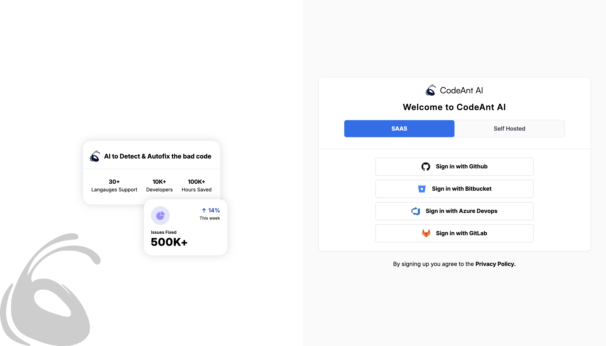

# CodeAnt AI Clone

## Overview

This project is a **clone of CodeAnt AI**, focusing on implementing:

1. A **Login Page** for user authentication.
2. A **Repositories Page** to display and manage GitHub repositories for a selected username.

The application is built using **React** and styled with **TailwindCSS**, ensuring a responsive and user-friendly design.

---

## Deployed URL

Access the live demo at https://codeant-frontend-assignment.vercel.app/login

## Features

### 1. **Login Page**

- User authentication interface with:
  - Various login methods for Self Hosted and SAAS.
  - A submit button to log in.
- Responsive design for desktop and mobile devices.

### 2. **Repositories Page**

- Fetches repositories for a specified GitHub username using the GitHub API.
- Key functionalities include:
  - **Display Repository Details**:
    - Repository Name
    - Visibility (Public/Private)
    - Last updated time (e.g., "Updated 3 days ago")
    - Size
    - Primary Language
  - **Search Functionality**: Filter repositories by name.
  - **Refresh Button**: Reloads the repository list.
  - **Logout**: Logout button in the sidebar stimulates the logout by going to signin page when clicked on it.
- Fully responsive layout adapting to different screen sizes.

### 3. **Under Construction Page**

- For All the other routes in the sidebar, since they aren't developed yet, i created a site under construction route.
- They can navigate to homepage again ensuring the closage of loop.
- Fully responsive layout adapting to different screen sizes.

### 3. **Responsive Sidebar Navigation**

- **Desktop View**:
  - Vertical sidebar with navigation links.
  - Dropdown for selecting a GitHub username.
  - Active link highlighted for better user experience.
- **Mobile View**:
  - Collapsible hamburger menu for navigation.
  - Top-to-bottom menu layout for smaller screens.

---

## Technologies Used

- **React**: For dynamic UI components.
- **React Router**: For managing navigation and routing.
- **TailwindCSS**: For responsive and modern styling.
- **GitHub API**: For fetching repository data.

---

## How to Run

### Prerequisites

- Node.js and npm installed on your system.

## How to Run

### Prerequisites

- Node.js and npm installed on your system.

### Steps

1. Clone the repository:

   ```bash
   git clone git@github.com:Phani4658/codeant-frontend-assignment.git
   cd codeant-frontend-assignment
   ```

   2. Install dependencies:

   ```bash
   npm install
   ```

   3. Start the application:

   ```bash
   npm start
   ```

   4. Open the application in your browser:

   ```bash
   http://localhost:5173
   ```

## Pages Overview

1. Login Page

   - Accessible at the root URL (/).
   - Includes fields for username and password.
   - Basic validation for user input.

2. Repositories Page
   - Accessible post-login.
   - Features:
     - List of repositories for the selected GitHub username.
     - Search functionality to filter repositories.
     - Refresh button to reload data.
     - Responsive design for all devices.

## Additional Information

### Improvements

- Implementing github data fetching for a fully stimulation of real scenarios.

• Adding more interactivity and user feedback (e.g., loading spinners or error messages).

### Preview

- **Live URL**: https://codeant-frontend-assignment.vercel.app/login

#### Login Page



#### Repositories Page


#### Under Development Page


### Author
**Phani**
[Linkedin](https://linkedin.com/in/phani-cse)
